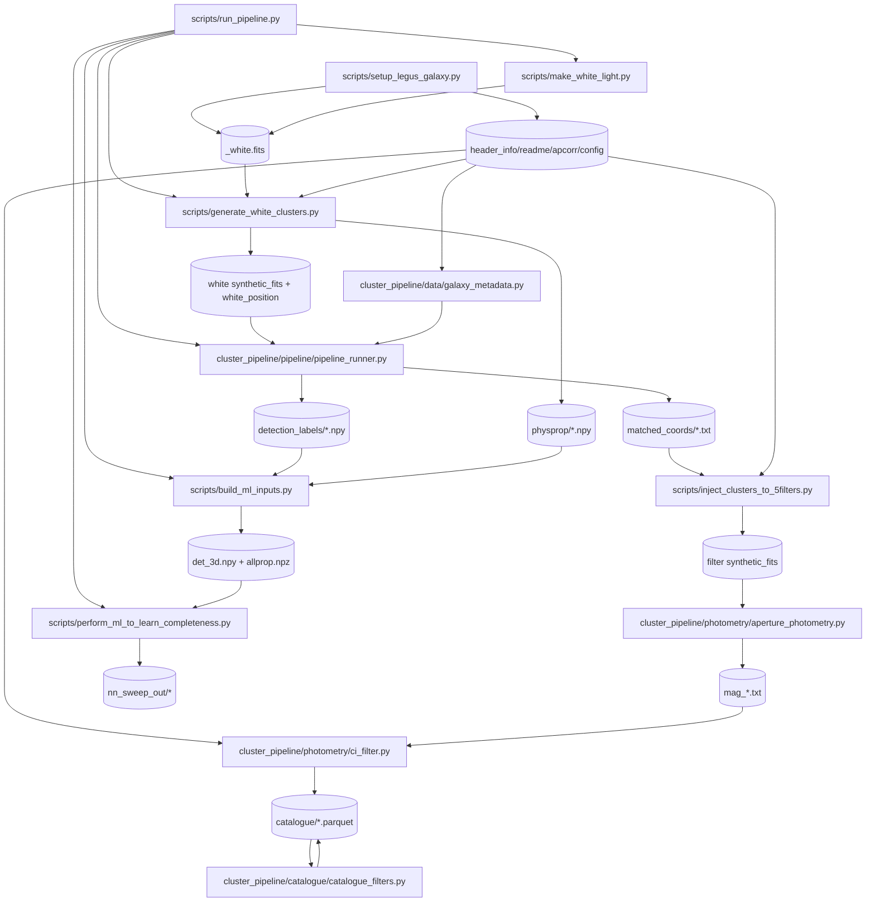

# Pipeline File Flow (run_pipeline + photometry + NN)

This document maps the end-to-end flow from `run_pipeline.py` through
photometry/catalogue and NN fitting, including entry points, inputs, outputs,
and key defaults.

---

## 1) Top-level entry

## `scripts/run_pipeline.py`

- **Entry point**
  - `python scripts/run_pipeline.py ...`
- **Role**
  - Orchestrates:
    1. White science frame generation (when `--sciframe` not provided)
    2. Phase A (`generate_white_clusters.py`)
    3. Phase B (`cluster_pipeline` detection/matching/photometry/catalogue)
    4. Optional ML build + training (`--run_ml`)
- **Key inputs**
  - CLI: `--galaxy --outname --dmod --nframe --reff_list --ncl --sigma_pc ...`
  - Env: `COMP_FITS_PATH`, `COMP_PSF_PATH`, `COMP_BAO_PATH`, `COMP_SLUG_LIB_DIR`, optional `COMP_SCIFRAME`
- **Key outputs**
  - `/<galaxy>/white/*` and `physprop/*.npy`
  - Optional: `det_3d.npy`, `allprop.npz`, `nn_sweep_out/*`
- **Important defaults**
  - `--galaxy ngc628-c`
  - `--outname test`
  - `--dmod 29.98`
  - `--nframe 1`, `--ncl 500`, `--sigma_pc 100`
  - If `--sciframe` is not given, script generates `<galaxy>/<galaxy>_white.fits` first and passes it explicitly into Phase A.

---

## 2) White frame generation

## `scripts/make_white_light.py`

- **Entry point**
  - Called by `run_pipeline.py` (or manual CLI)
- **Role**
  - Build `<galaxy>_white.fits` from filter FITS (`f275w/f336w/f435w/f555w/f814w`)
- **Inputs**
  - FITS files under `<project_root>/<galaxy>/`
- **Outputs**
  - `<project_root>/<galaxy>/<galaxy>_white.fits`
- **Default**
  - `--project-root /g/data/jh2/jt4478/comp_pipeline_restructure`

---

## 3) Galaxy data bootstrap (download/extract/sync)

## `scripts/setup_legus_galaxy.py`

- **Entry point**
  - Manual setup for one galaxy/pointing
- **Role**
  - Download LEGUS FITS + readme/config, extract archives, create white FITS
  - Sync key metadata files to galaxy root for pipeline compatibility
- **Inputs**
  - `--galaxy`, optional direct `--fits-url` links
- **Outputs**
  - `<galaxy>_white.fits`
  - Synced key files in `<project_root>/<galaxy>/`:
    - `automatic_catalog_<gal>.readme`
    - `avg_aperture_correction_<gal>.txt`
    - `header_info_<gal>.txt`
    - `r2_wl_aa_<gal>.config`

---

## 4) Phase A (white injection)

## `scripts/generate_white_clusters.py`

- **Entry point**
  - Called from `run_pipeline.py` Phase A
- **Role**
  - Sample clusters (SLUG or `--input_coords`)
  - Inject into white science frame
  - Produce white synthetic frames and white positions
  - Save physprop arrays
- **Inputs**
  - `--sciframe` (white frame path)
  - `galaxy_filter_dict.npy`, `galaxy_names.npy`
  - `automatic_catalog*_<gal>.readme` (aperture/CI/distance)
  - `header_info_<gal>.txt` (filter metadata)
  - SLUG library, PSF files, BAOlab
- **Outputs**
  - `<galaxy>/white/synthetic_fits/*.fits`
  - `<galaxy>/white/white_position_*.txt`
  - `physprop/mass|age|av|mag_*.npy`
- **Defaults**
  - `--sigma_pc 100`
  - `--galaxy_fullname` falls back to `--gal_name` if omitted

---

## 5) Phase B orchestrator (detection/matching/photometry/catalogue)

## `cluster_pipeline/pipeline/pipeline_runner.py`

- **Entry point**
  - Called by `run_pipeline.py -> run_phase_b() -> run_galaxy_pipeline(...)`
- **Role**
  - Stage 2/3: source detection + coordinate matching
  - Stage 4/5 (`run_photometry=True`): 5-filter photometry, CI/merr cuts, catalogue parquet
  - Write binary detection labels
- **Inputs**
  - `PipelineConfig` from `run_pipeline.py`
  - `inject_5filter_script` (default: `scripts/inject_clusters_to_5filters.py`)
  - Galaxy metadata + aperture correction file
- **Outputs**
  - `<galaxy>/white/matched_coords/*.txt`
  - `<galaxy>/white/catalogue/*.parquet`
  - `<galaxy>/white/detection_labels/*.npy`
  - `<galaxy>/white/diagnostics/*`

---

## 6) 5-filter injection used by photometry path

## `scripts/inject_clusters_to_5filters.py`

- **Entry point**
  - Called by pipeline runner when photometry is enabled
- **Role**
  - Inject white-detected/matched clusters into each filter synthetic frame
- **Inputs**
  - `--gal_name` (required), `--dmod`, frame/reff args
  - `header_info_<gal>.txt`, `automatic_catalog*_<gal>.readme`
  - Filter science FITS and PSF
- **Outputs**
  - `<galaxy>/<filter>/synthetic_fits/*.fits`
  - Intermediate `baolab/`, `synthetic_frames/`
- **Current behavior**
  - Hardcoded `ngc628-c` filter index usage removed
  - Hardcoded `psf_ngc1566...` fallback removed (missing PSF now fails fast)

---

## 7) Metadata loader for photometry/catalogue

## `cluster_pipeline/data/galaxy_metadata.py`

- **Entry point**
  - Used by pipeline runner in photometry stage
- **Role**
  - Load filters, camera/instrument, zeropoints, exptimes, aperture radius, dmod, CI threshold
- **Inputs**
  - `galaxy_filter_dict.npy`
  - `header_info_<gal>.txt`
  - `automatic_catalog*_<gal>.readme`
- **Outputs**
  - `GalaxyMetadata` object (`filters`, `zeropoints`, `exptimes`, `distance_modulus`, `ci_cut`, `aperture_radius`)
- **Defaults**
  - If CI missing, runner defaults to `1.4`
  - If dmod missing in readme, runner falls back to `config.dmod`

---

## 8) Photometry + CI cut + aperture correction

## `cluster_pipeline/photometry/aperture_photometry.py`

- **Role**
  - Run IRAF aperture photometry (`phot`) on matched coordinates
- **Input**
  - Frame FITS, matched coords, zeropoint, exptime, apertures
- **Output**
  - `mag_*.mag` and parsed `mag_*.txt`

## `cluster_pipeline/photometry/ci_filter.py`

- **Role**
  - Compute CI = `mag(1px) - mag(3px)`
  - Apply aperture correction:
    - `mag += apcorr`
    - `merr = sqrt(merr^2 + apcorrerr^2)`
  - Apply `merr_cut` and V-band CI threshold
- **Input**
  - `mag_*.txt`, CI threshold, `merr_cut`, `apcorr/apcorrerr`
- **Output**
  - Filtered photometry arrays used for parquet rows

---

## 9) Catalogue rule application

## `cluster_pipeline/catalogue/catalogue_filters.py`

- **Role**
  - Build `in_catalogue` according to criteria:
    - at least 4 bands with `merr <= 0.3`
    - `M_V <= -6` (uses dmod)
    - CI pass from photometry
- **Input**
  - Photometry parquet + dmod + v/b/i filter names
- **Output**
  - Catalogue dataframe written to parquet by pipeline runner

---

## 10) ML input builder

## `scripts/build_ml_inputs.py`

- **Entry point**
  - Called by `run_pipeline.py --run_ml` (or manually)
- **Role**
  - Convert detection labels + physprop arrays into NN inputs
- **Inputs**
  - `<galaxy>/white/detection_labels/*.npy`
  - `physprop/*.npy`
  - `--galaxy --outname --nframe --reff-list`
- **Outputs**
  - `det_3d.npy` (default at project root)
  - `allprop.npz` (default at project root)
- **Defaults**
  - `--galaxy ngc628-c`, `--outname test`

---

## 11) NN fitting

## `scripts/perform_ml_to_learn_completeness.py`

- **Entry point**
  - Called by `run_pipeline.py --run_ml` (second ML step)
- **Role**
  - Train MLPs (phys + phot), hyperparameter sweep, save best checkpoints
- **Inputs**
  - `--det-path` (required)
  - `--npz-path` (required)
  - `--clusters-per-frame --nframes --nreff`
- **Outputs** (default under `./nn_sweep_out`)
  - `checkpoints/best_model_phys_<outname>.pt`
  - `checkpoints/best_model_phot_<outname>.pt`
  - `scaler_phys_<outname>.pkl`, `scaler_phot_<outname>.pkl`
  - sweep plots and lr/wd grids (`.png`, `.npz`)
- **Defaults**
  - `--out-dir ./nn_sweep_out`
  - `--outname model0`
  - `--drop-frame 0`, `--clusters-per-frame 500`, `--nframes 50`, `--nreff 10`

---

## 12) Pre-flight validation

## `scripts/check_pipeline_paths.py`

- **Entry point**
  - Manual or `run_pipeline.py --check-only`
- **Role**
  - Validate required files/paths before a full run
- **Inputs**
  - `--galaxy`, optional `--run-photometry`, and `COMP_*` env vars
- **Output**
  - Exit code 0/1 + missing file report
- **Default**
  - `--galaxy ngc628-c`

---

## Minimal must-have files per galaxy/pointing

Under `<project_root>/<galaxy>/` (or discoverable via `COMP_FITS_PATH`):

- `<galaxy>_white.fits` (generated or provided)
- `r2_wl_aa_<galaxy>.config`
- `header_info_<galaxy>.txt`
- `automatic_catalog_<galaxy>.readme` (or `automatic_catalog*_<gal_short>.readme`)
- `avg_aperture_correction_<galaxy>.txt`
- 5 filter science FITS (`f275w`, `f336w`, `f435w`, `f555w`, `f814w`)

Project root must also include:

- `galaxy_filter_dict.npy`
- `galaxy_names.npy`
- `output.param`
- `default.nnw`
- SLUG library dir + PSF dir + BAOlab binary (via env or defaults)

---

## File dependency graph (read/write)

---

## Stage-by-stage read/write quick table

| Stage | Main script/module | Reads | Writes |
|---|---|---|---|
| Data bootstrap | `scripts/setup_legus_galaxy.py` | LEGUS URLs, `--galaxy` | FITS, metadata txt/readme/config, `<galaxy>_white.fits` |
| White build | `scripts/make_white_light.py` | 5 filter FITS | `<galaxy>_white.fits` |
| Phase A | `scripts/generate_white_clusters.py` | white FITS, readme/header, SLUG/PSF/BAO | `white/synthetic_fits`, `white_position`, `physprop/*.npy` |
| Detect + match | `cluster_pipeline/pipeline/pipeline_runner.py` | white synthetic frames + metadata | `matched_coords/*.txt`, `detection_labels/*.npy` |
| 5-filter inject | `scripts/inject_clusters_to_5filters.py` | matched coords, metadata, filter FITS, PSF | per-filter synthetic FITS |
| Photometry | `cluster_pipeline/photometry/aperture_photometry.py` | per-filter synthetic FITS, coords, zp/exptime | `mag_*.txt` |
| CI/apcorr filtering | `cluster_pipeline/photometry/ci_filter.py` | `mag_*.txt`, CI threshold, apcorr file | filtered phot arrays |
| Catalogue rules | `cluster_pipeline/catalogue/catalogue_filters.py` | filtered phot + dmod | `catalogue/*.parquet` (`in_catalogue`) |
| ML input build | `scripts/build_ml_inputs.py` | `detection_labels/*.npy`, `physprop/*.npy` | `det_3d.npy`, `allprop.npz` |
| NN training | `scripts/perform_ml_to_learn_completeness.py` | `det_3d.npy`, `allprop.npz` | checkpoints, scalers, sweep outputs |

